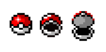
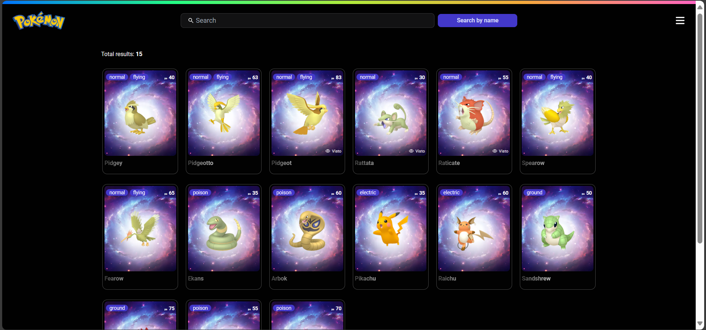
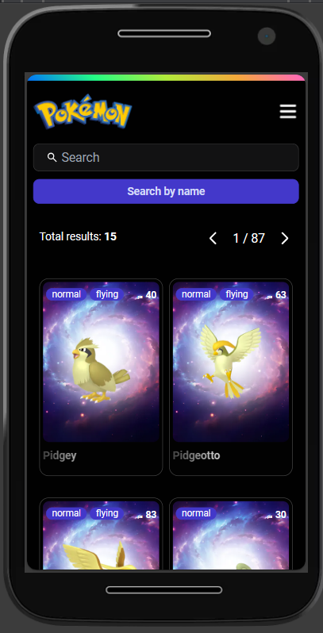

<div align="center">
 
  <br>
  <h1>
  Pokemons gallery
  </h1>
  <br>
</div>

<div>
An interactive pokemon gallery, with details such as basic information and pokemon stats, and you can also listen to it scream

</div>

## Site

<table width="100%" border="0">
<tr> 
<td width="60%">
 
</td>
<td width="30%">
 
</td>
</tr>

</table>

#### Get started

Install dependencies

```
  cd pokemon
  npm install or yard install
```

Run project

```
  npm run dev
```

or

```
  yarn dev
```

## Demo

Here is a working live demo : [Demo](https://pokemon-eight-rho.vercel.app/home?page=1)

## API

Pokémon API : https://pokeapi.co/

## Key Features

- List of pokemon cards with a short background information
- More detailed information when clicking on a card
- Cards highlighted with an icon to indicate that it has already been viewed
- Drawer menu
- Find pokemons with the search input
- Paginated search
- List of items
- Responsive design
- User-friendly design

## Build with 🛠️

- [Next](https://nextjs.org/)
- [TypeScript](https://www.typescriptlang.org/docs/)
- [zustand](https://docs.pmnd.rs/zustand/getting-started/introduction)
- [React Query](https://tanstack.com/query/latest/docs/framework/react/overview)
- [Testing Library](https://testing-library.com/docs/react-testing-library/intro/)
- [Tailwind](https://tailwindcss.com/)
- [DaisyUI](https://daisyui.com/)
- [husky](https://typicode.github.io/husky/get-started.html)
